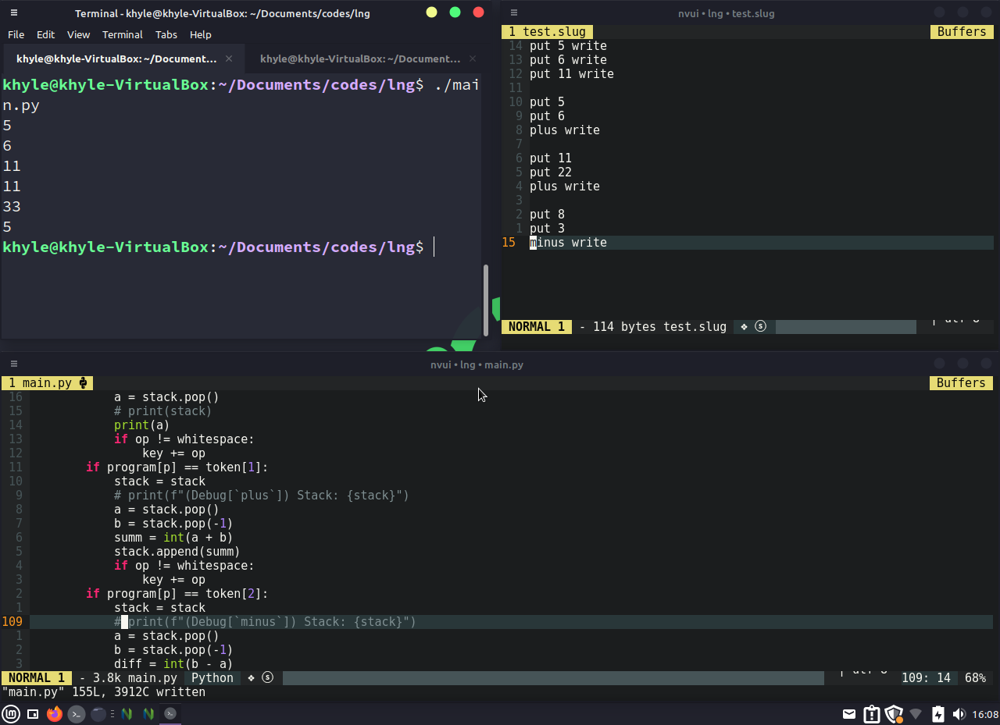

# Slug


The basic program made in Slug

## About this Project
A Hobby Programming Language Made In Python.

This is inspired in [Tsoding's Porth](https://gitlab.com/tsoding/porth) Programming Language.

## Quick Start
Make sure you have `rust` installed in your system as slug code translates into rust code.

First, you need to execute the [build.sh](./build.sh) script to have a `slug` executable in your system.
```console
$ ./build.sh && slug
```

To display help:
```console
$ slug -h 
```

To compile program(WARNING: compilation is still work in progress, but you can use it now.):
```console
$ slug -c <filename>
```

## Language Basics
To put a number into a stack and print it you do:
```
put 20 write
```

To add numbers and print it you do:
```
put 20
put 30
+ write
```

To subtract numbers and print it you do:
```
put 30
put 20
- write
```

To multiply numbers and print it you do:
```
put 20
put 30
* write
```

To divide numbers and print it you do:
```
put 2
put 20
/ write
```

Variable assigning:
```
put 5 as a
put 6 as b
+ as c
a write
b write
c write
```
# WARNING!!!
### This is still in development, do this in your own risk.

## Contributing
For contributions, visit [CONTRIBUTING.md](./CONTRIBUTING.md) for more info.
